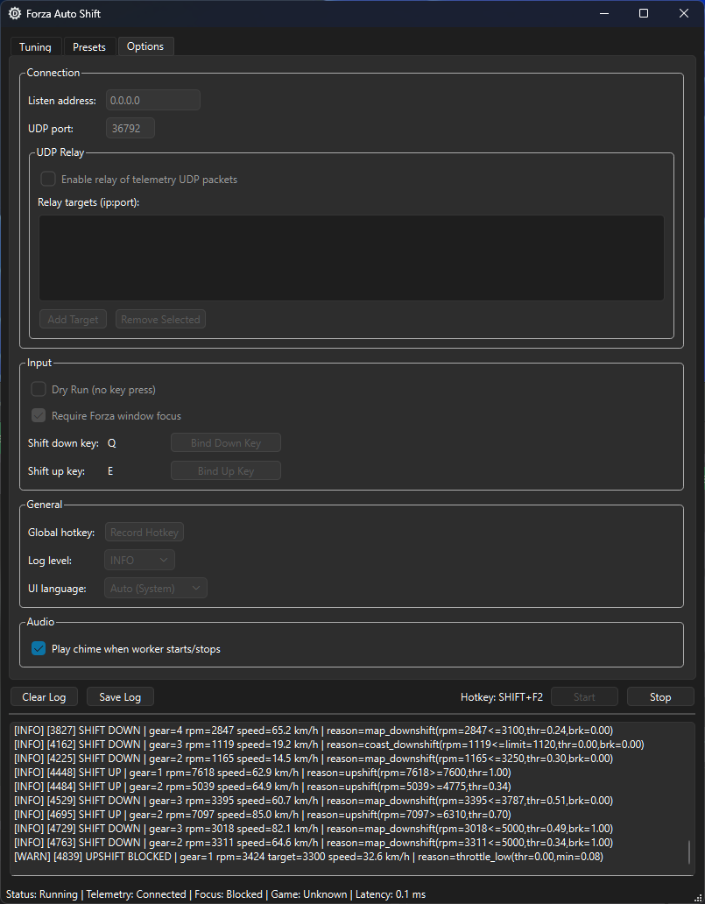
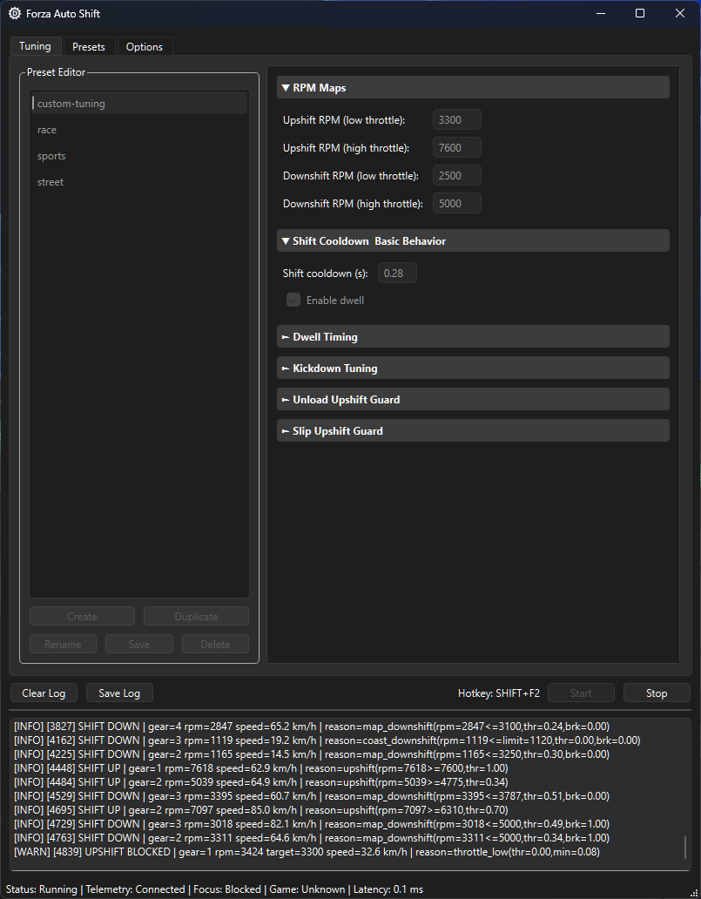
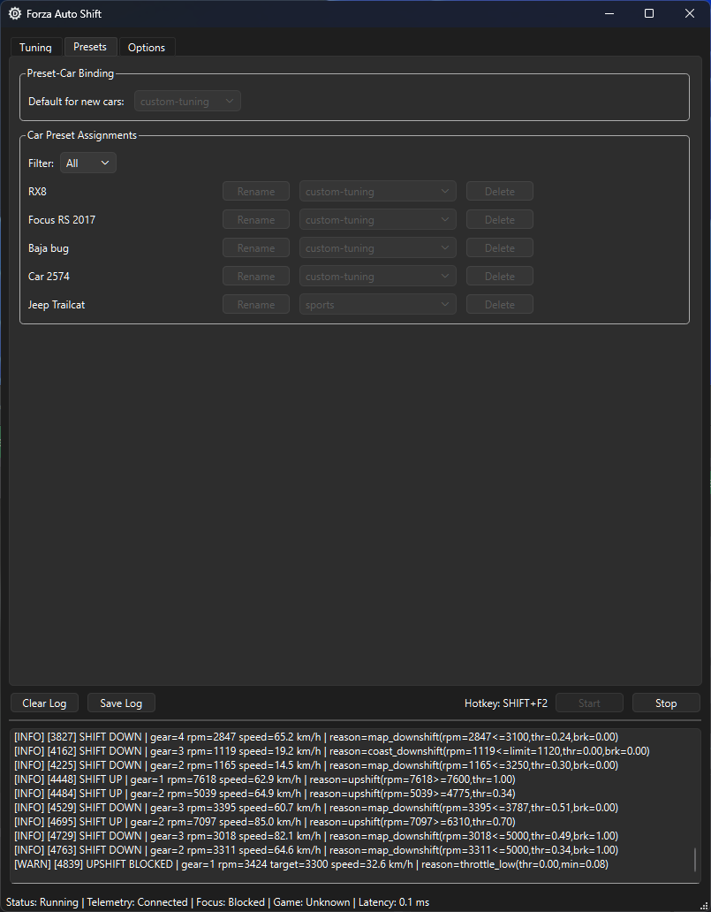

# Forza Auto Shift

Automatic transmission assistant for Forza using UDP telemetry + keyboard input simulation.

This app reads game telemetry, decides shift actions based on tunable rules, and sends shift key inputs to the game to emulate automatic transmission behavior.

## Use Cases

- Casual cruising: drive with smoother, more relaxed shifts without manually managing gears.
- Automatic-like reverse behavior: avoid the "hold brake to reverse" style and get a more natural AT feel.
- Consistent daily driving setup: keep one preferred shift behavior across different cars with presets and per-car binding.
- Tuned driving styles: switch from comfort to aggressive shift maps without reconfiguring everything each session.

## Screenshots





## Features

- PySide6 desktop UI for live tuning and controls.
- Supports configurable upshift/downshift RPM maps.
- Shift behavior tuning: cooldown, dwell, kickdown, low-speed recovery, unload/slip guards.
- Presets and per-car preset binding.
- Optional UDP relay passthrough for telemetry packets.
- Start/stop hotkey recording.
- Multi-language UI (Auto, English, Spanish, French, German, Chinese Simplified, Chinese Traditional, Japanese).
- Optional chime on worker start/stop.

## Requirements

- Windows (recommended; packaging scripts target Windows).
- Python 3.10+ (currently tested with newer 3.x too).
- Forza telemetry enabled in-game.

Python dependencies are listed in `requirements.txt`:

## Installation

```powershell
python -m venv venv
.\venv\Scripts\Activate.ps1
python -m pip install -U pip
python -m pip install -r requirements.txt
```

## Run (Development)

Use package entrypoint:

```powershell
python -m forza_auto_shift
```

Or the PyInstaller launcher script used for frozen builds:

```powershell
python run.py
```

## Forza Telemetry Setup

In game:

`SETTINGS > GAMEPLAY & HUD > UDP RACE TELEMETRY`

Set:

- Data Out: enabled
- Data Out IP Address: your receiver IP (use `127.0.0.1` for local app)
- Data Out IP Port: matches app port (default is app-controlled)
- Packet Format: `Dash`

## State File Location

Default (release-friendly):

- `%LOCALAPPDATA%\ForzaAutoShift\forza_auto_shift_state.json`

Portable mode:

- Create an empty file named `portable` in the same folder as the executable.
- Then state file is stored beside the executable.

## Packaging (PyInstaller)

This repo includes a build helper script:

- `tools/build_pyinstaller.ps1`

### Build commands

Dry run:

```powershell
.\tools\build_pyinstaller.ps1 -Mode onedir -DryRun
```

Onedir build (recommended first pass):

```powershell
.\tools\build_pyinstaller.ps1 -Mode onedir
```

Onefile build:

```powershell
.\tools\build_pyinstaller.ps1 -Mode onefile
```

### Build script notes

- Uses `run.py` as entrypoint to avoid relative import issues in frozen apps.
- Bundles `forza_auto_shift/assets` and `forza_auto_shift/i18n`.
- Uses custom exe icon by default from `forza_auto_shift/assets/icon.ico`.
- Excludes heavy unused Qt modules to reduce final size.

Override icon path:

```powershell
.\tools\build_pyinstaller.ps1 -Mode onefile -IconPath "forza_auto_shift\assets\icon.ico"
```

## Localization Workflow

Translation files are in `forza_auto_shift/i18n`:

- Source: `.ts`
- Runtime: `.qm`

Rebuild `.qm` files from `.ts`:

```powershell
venv/Scripts/pyside6-lrelease.exe forza_auto_shift/i18n/forza_auto_shift_es.ts -qm forza_auto_shift/i18n/forza_auto_shift_es.qm
venv/Scripts/pyside6-lrelease.exe forza_auto_shift/i18n/forza_auto_shift_fr.ts -qm forza_auto_shift/i18n/forza_auto_shift_fr.qm
venv/Scripts/pyside6-lrelease.exe forza_auto_shift/i18n/forza_auto_shift_de.ts -qm forza_auto_shift/i18n/forza_auto_shift_de.qm
venv/Scripts/pyside6-lrelease.exe forza_auto_shift/i18n/forza_auto_shift_zh_cn.ts -qm forza_auto_shift/i18n/forza_auto_shift_zh_cn.qm
venv/Scripts/pyside6-lrelease.exe forza_auto_shift/i18n/forza_auto_shift_zh_tw.ts -qm forza_auto_shift/i18n/forza_auto_shift_zh_tw.qm
venv/Scripts/pyside6-lrelease.exe forza_auto_shift/i18n/forza_auto_shift_ja_jp.ts -qm forza_auto_shift/i18n/forza_auto_shift_ja_jp.qm
```

## Tests

Available tests:

- `tests/test_telemetry.py`
- `tests/test_transmission_sim.py`
- `tests/test_udp_sink.py`

Run all tests:

```powershell
python -m pytest
```

If `pytest` is not installed:

```powershell
python -m pip install pytest
python -m pytest
```

## License

- Project license: MIT (see `LICENSE`).
- Third-party dependency notices: see `THIRD_PARTY_NOTICES.md`.

## Troubleshooting

`ImportError: attempted relative import with no known parent package` in packaged app:

- Use the provided PyInstaller script (it builds from `run.py`).

UI language changes not fully visible:

- Restart app after changing language.

No telemetry received:

- Verify in-game telemetry settings.
- Confirm IP/port match app settings.
- Confirm firewall allows UDP traffic for the selected port.

Shift keys are not being sent to the game:

- If the game is launched as Administrator, this app must also be run as Administrator.
- On Windows, lower-privilege processes cannot reliably send input to higher-privilege windows.

## Disclaimer

This is an unofficial community tool and is not affiliated with Turn 10 Studios, Playground Games, or Microsoft.

